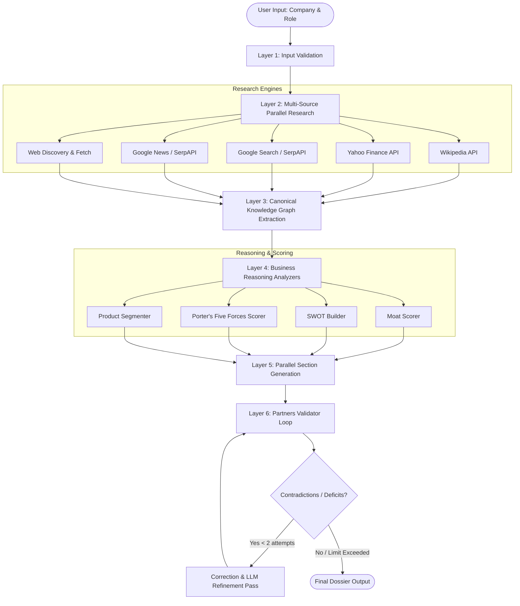

# 🚀 CareerDeck

> **Your McKinsey-grade interview prep deck** — AI-powered dossiers for MBA students and early-career professionals.

CareerDeck automates deep company research, competitive analysis, and interview playbook generation. Input a company name, target role, and job description to get a comprehensive, 15+ page dossier in minutes.

---

## 🏗️ Architecture: Self-Healing 6-Layer LangGraph Pipeline

CareerDeck runs on a highly structured multi-agent LangGraph workflow designed to eliminate hallucinations and guarantee factuality.



---

## ✨ Features

*   **⚡ Real-Time Ingestion**: Scrapes Wikipedia, Yahoo Finance summary metrics, and live news articles concurrently.
*   **🧠 Canonical Knowledge Graph**: Extracts verified, structured data (`CoreFacts`) first to ensure sections do not make contradictory claims.
*   **🛡️ Negative-Hallucination Prevention**: Explicitly handles unknown/unverified facts, separating "insufficient data" from actual competitive weakness.
*   **⚖️ Structured Porter's Five Forces**: Provides concrete evidence and strategic reasoning justification for every single force score.
*   **🔄 Self-Healing Validator Loop**: Automatically checks sections for repetitive texts, unsupported claims, and conflicts, triggering refinement passes to auto-fix errors.

---

## 🛠️ Quick Start

### 1. Installation

```bash
git clone https://github.com/Raneshsharma/careerdeck.xyz-.git
cd careerdeck.xyz
npm install
```

### 2. Configure Environment

Copy the example environment file and configure your API keys:

```bash
cp .env.example .env.local
```

Open `.env.local` and configure the following parameters:

| Key | Required | Default | Description |
| :--- | :---: | :---: | :--- |
| `LLM_PROVIDER` | No | `openai` | LLM service provider (`openai` \| `gemini` \| `openrouter`) |
| `OPENAI_API_KEY` | Yes* | - | OpenAI API key (required if using openai provider) |
| `OPENAI_MODEL` | No | `gpt-4o-mini` | OpenAI Model name |
| `SERP_API_KEY` | Yes* | - | SerpAPI key for Google Search and Google News fallback |
| `GOOGLE_CSE_API_KEY`| No | - | Google Custom Search API Key |
| `GOOGLE_CSE_ID` | No | - | Google Custom Search Engine ID |
| `GNEWS_API_KEY` | No | - | GNews API Key |

> [!TIP]
> If `GOOGLE_CSE` keys are missing, the research node automatically falls back to your `SERP_API_KEY`.

### 3. Run Development Server

```bash
npm run dev
```

Visit [http://localhost:3000](http://localhost:3000) to start generating dossiers.

---

## 📦 Tech Stack

*   **Frontend & API**: Next.js 14 (App Router)
*   **Styling**: Tailwind CSS
*   **Orchestration**: LangGraph.js / LangChain
*   **Real-time Streaming**: Server-Sent Events (SSE)
*   **Data Aggregation**: Yahoo Finance, Wikipedia API, SerpAPI

---

## 📄 License

MIT
